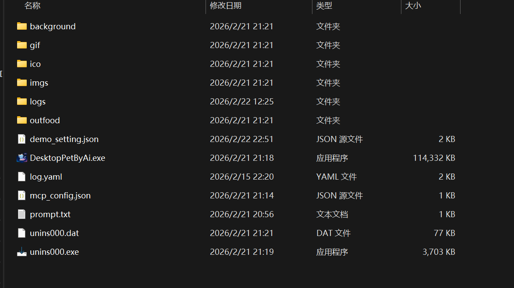
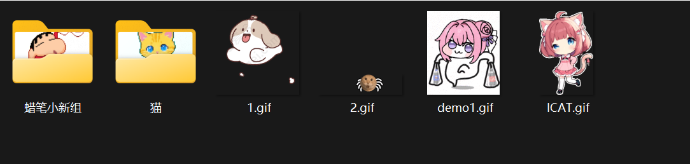
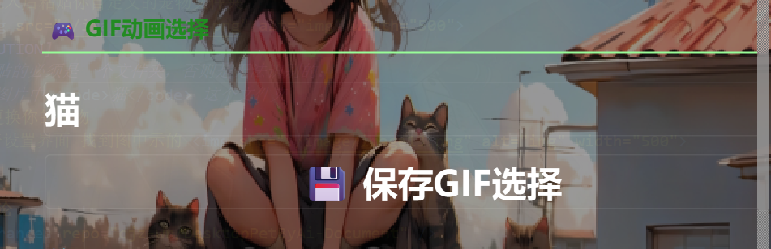
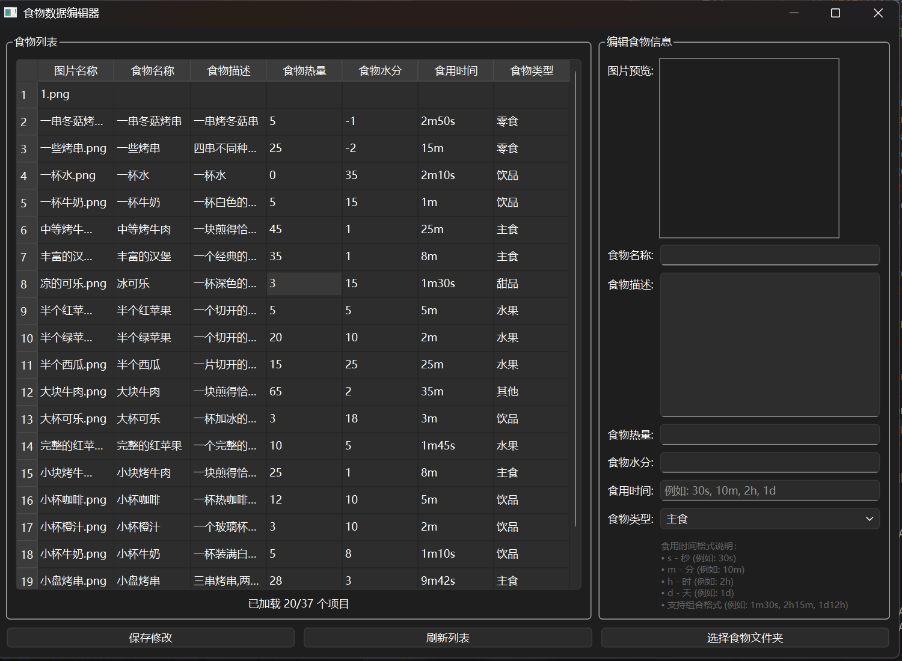

# DesktopPetByAi的开发

## mcp服务器的配置

- 如果你要配置一个mcp服务器的话，那么你需要先到[魔塔社区](https://www.modelscope.cn/mcp)里面去注册一个账号,当然,你点击进去的也是mcp调用的界面.
  - 如果你不知道如何获取到一个mcp服务器的话，你可以问问ai哦
### 配置你的mcp服务器
- 打开你的设置界面，往下化滚找到图示所示 
- 点击添加服务器
- 输入你的服务器名称(**ai会根据你的名称来调用哦，所以不要乱填哦，你获取mcp的时候会得到这个mcp的名称，你填进去即可**)，你的服务器url
- 
>[!IMPORTANT]
>你的服务器类型目前必须是 sse 因为目前仅支持这个
- 点击确定即可
>[!NOTE]
>对了，那个界面(启用服务器那里，默认是绿色的，即启用，如果你目前不想启用就点一下)

## gif动画的选择

- **默认的宠物或许并不能满足你，这里我们允许你自定义你的宠物**
- 1.首先打开你的软件安装的根目录(即有exe的那个目录)，然后找到gif文件夹,如图 
- 2.进入后粘贴你自定义的宠物文件夹
- 
>[!CAUTION]
>你粘贴的必须是一个文件夹，否则是无法识别的.
>例如图片中 <code>猫</code> 这个文件夹
- 3.更换你的宠物
- 打开设置界面 找到图中示的 <code>gif动画选择</code> 点击更换即可
- 

## 自定义食物
>[!IMPORTANT]
>如果你需要自定义食物的话，目前需要你的电脑中具备python环境，因为目前我们并未提供 <code>exe</code> 格式的编辑器
- 1.在[DesktopPetByAi](https://github.com/cjz-wr/DesktopPetByAi)的根目录下找到 <code>food_editor.py</code> 文件下载它
- 2.运行这个代码文件，如图:
- 然后就可以编辑食物了,关于食物的图片,你需要将其放到 软件安装的根目录下的 <code>outputfood</code> 文件夹里面才会加载出来
- 3.待文件加载出来后编辑食物信息即可

## 插件功能
>[!TIP]
>关于插件功能，这里面我们其实是集成了 <code>skills</code> 和 <code>py</code> 插件(脚本)的功能,但为了减少一些代码量，所以将这两个功能给集成到了一起，并统称为插件
### 关于skill
- **skill**即技能,它类似于提示词(prompt)的功能,这个的作用指在为ai执行一些命令的时候提供一个可靠的步骤.

>[!NOTE]
>既然如此，那么为何不是直接使用prompt呢？
>普通的prompt是直接写在了ai的记忆里面了,而这个是在ai需要调用的时候才被写入记忆里面，并且当指令完成后就会删除掉记忆中的 skill
>这样就可以大大的减少了对记忆占用

- <code>skill</code>是以 <code>.md</code> 文件保存的,其存储在软件的安装目录下面的<code>yyskills</code>文件夹里面
  
### 关于py插件(脚本)

- **py插件** 即一个以python为编程语言写的插件.该插件类似于mcp(这个说法并不太对),更形象的说法是一个可以被ai调用的工具
>[!NOTE]
>为什么要有插件
>这样其实可以大大的提高软件的可玩性
- 当你要进行插件开发时，只要以我们规定的接口对接即可
- 插件默认是存放在软件的安装目录下面的 <code>plugins</code> 文件夹里面,当你获得一个插件时就需要将其放到这个文件夹里面

## 评论
<Utterances repo="cjz-wr/DesktopPetByAi-Document" />
