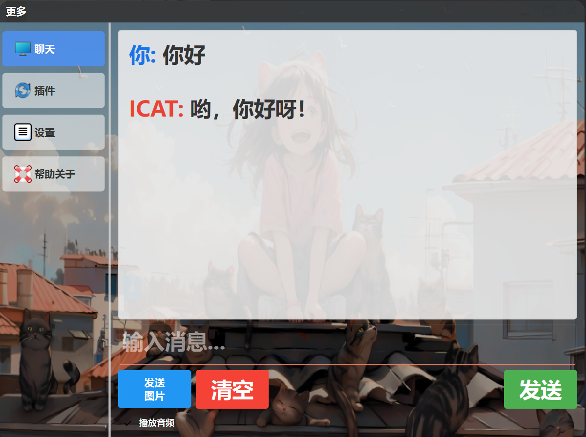
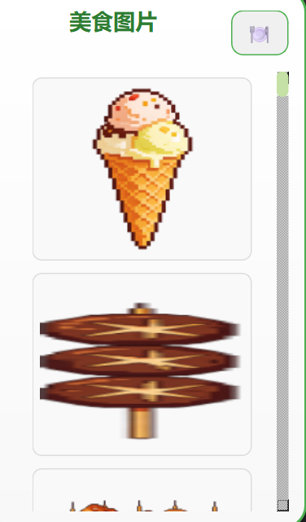

# DesktopPetByAi的更多功能

## 关于聊天

其实聊天功能和其它的ai软件并没有太大的区别，而它的智能程度取决于你调用的ai接口的智能程度。
- 如果你想要打开它，在系统托盘里面找到DesktopPetByAi的图标，然后点击右键 
- 点击更多 
- 就可以看到聊天功能了 

- 在这里面，她不仅仅可以发送纯文本，也可以发送图片，对了有些是她的表情包哦，当然ai生成的图片相信你也可以看得出来
- 在下面你还可以看到是否播放音频是选项，这个默认是勾上的，如果你不勾选，那么当她回复的时候，不会播放音频（这个功能并不需要你配置ai哦）

## 关于设置

- 在设置界面你可以看到许多的功能
  - **选择背景图片** 你可以在这里修改你的背景图片
  - **图片透明度** 你可以在这里修改你的图片的透明度
  - **当前的亮度** 你可以在这里修改你的图片的亮度
  >[!TIP]
  >透明度的修改和亮度的修改都会影响到宠物的显示哦
  - **GIF动画选择** 你可以在这里选择你的宠物 **[详细的gif选择](/develop#gif动画选择)**
  >[!IMPORTANT]
  >如果你想要自定义你的宠物形象的话，那么可以到这个软件的安装目录下找到 **gif** 文件夹，然后把自己想要添加的 **宠物动画组** 以文件夹的形式放进去里面，这样子就可以添加自己的宠物了
  - **ai角色设定** 你可以在这里设定你的ai角色,你可以参考默认的角色设定来设置你的ai哦
  - **字体设置** 你可以在这里设置你的字体
  - **mcp服务器配置** 你可以在这里配置你的mcp服务器 **[mcp服务器的配置](/develop#mcp服务器的配置)**
  >[!NOTE]
  >后面会详细讲解这个的

## 关于 帮助关于

>[!NOTE]
>这里面主要显示软件的基本信息,仅此而已

## 关于宠物

- 当我们右击宠物时，你会发现新大陆哦，如果你以前玩过的话就当我没说.
  - 右击后我们可以看到一个宠物的饥饿度和水分，所以你要记得喂她哦
  - 当你把鼠标放到食谱上时，便会显示她可以进食的食物,如图
  - 
  - 点击食物你就可以看到食物的信息详细了
  - 当你点击右上角的餐盘按钮时，你就可以进入喂食的文件夹了.
    -你只要将需要喂食的食物拖到宠物身上就可以了
    >[!TIP]
    >你也可以自定义食物哦,可以参考后面开发的文章

**这样基本就没有什么了**
>[!TIP]
>对了，你如果注意观察宠物的话，你就可以发现宠物有时候会显示一些小语句哦
## 评论
<Utterances repo="cjz-wr/DesktopPetByAi-Document" />
