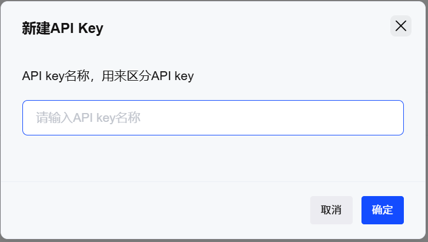
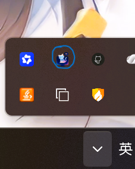
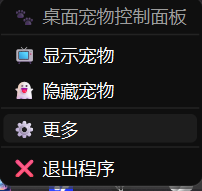
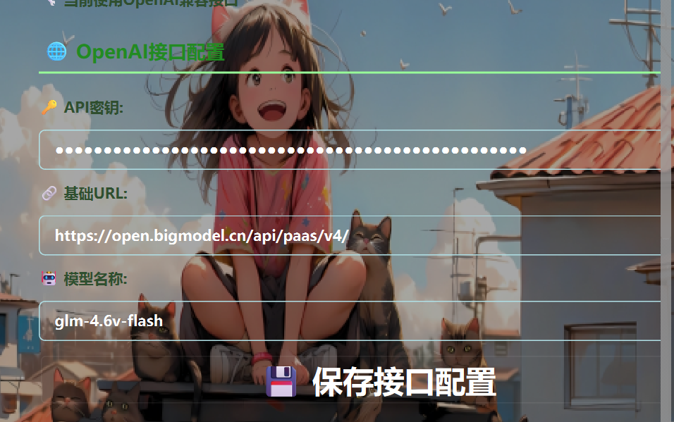

# 如何使用DesktopPetByAi

## 下载&安装
## 下载安装包 
- 1.通过访问[DesktopPetByAi](https://cjz-wr.github.io/DesktopPetByAiWeb/)来获取最新的下载链接或者访问[Github](https://github.com/cjz-wr/DesktopPetByAi/releases)来获取最新的安装包
> [!TIP]
>建议通过*后面*一个来进行下载(如果你有电脑基础的话),因为后面一个链接通常更新比前面的要快一点
>[!WARNING]
>如果你是非winows用户的话,那么你只能使用运行源代码的方式来运行我们的程序了

### 安装

- 1.当你下载好exe安装包后，直接双击安装包，安装里面的提示来安装即可
>[!IMPORTANT]
>注意: 该软件是默认不包含ai功能的，即你需要自行配置一个ai api才能使用.我们的ai支持openai api接口
- 2.安装完成后，随机DesktopPetByAi会自动启动,对了，她默认是不会在任务栏中显示的,她会隐藏在系统托盘里面(一般是这样的),她的图标和exe的图标是一样的.

## 源码安装
>[!WARNING]
>注意,你必须先安装好了git,并配置了环境
- 打开你要安装的目录，或者cmd到你要安装的目录，然后运行下面的命令
- ```powershell
    git clone https://github.com/cjz-wr/DesktopPetByAi.git
    cd DesktopPetByAi
    pip install -r requirements.txt
    python main.py

  ```

## 配置ai
>[!TIP]
>如果你没有配置ai的需求的话可以跳到 [探索更多](/more.md) 去发掘更多的功能

### 创建一个免费的ai api
>[!NOTE]
>如果你需要一个免费的api接口的话可以看看这个,不过这并非是一个好的选择，或许你已经想到了，这个免费的接口并不稳定(当然你也可以根据这个尝试购买他们的ai)。

>[!IMPORTANT]
>如果你会使用到ai画图和ai识别图片功能的话，还是建议你看看这个教程来配置他们的api(你也可以购买他们付费的ai接口,这不是广告，这不是广告),之所以建议是因为，目前对图片生成和图片识别是通过他们的模型来实现的，还未支持他们的模型，所以只能使用他们的api。不过后续我们可能会改变这一现状

- 1.我们首先需要访问 [智谱](https://open.bigmodel.cn/) 创建一个账号
>[!TIP]
  >这里建议直接通过手机号来创建，因为你微信扫码还是要绑定手机号的
- 2.然后我们将鼠标移到图中红色圈起来的区域,当 API key显示时点击它 
- 3.当界面跳转成功后点击右上角的 <span style="color: red;">添加API key</span> 来创建一个key 
- 4.图示的名称随便填即可
- 5.创建成功后，将key复制到剪贴板,鼠标点击一下蓝色圈起来的即可 

### 配置ai api
- 1.鼠标移到系统托盘(右下角)找到DesktopPetByAi的图标,然后点击右键 
- 2.点击更多 
- 3.点击设置 
- 4.向下滑动鼠标 找到图中所示 ,粘贴到api密钥里面
- 5.里面的URL则填 https://open.bigmodel.cn/api/paas/v4/
- 6.模型的话则选择 1.glm-4.6v-flash 2.glm-4.7-flash 3.glm-4.1V-Thinking-Flash 4.glm-4-Flash-250414 等，更多免费模型可以自行查看
- 7.<span style="color: red;">然后点击保存接口配置</span>(这是重要的)
>[!WARNING]
>记得重启你的程序

## 评论

<div id="utterances-container"></div>
<script src="https://utteranc.es/client.js"
        repo="cjz-wr/DesktopByAi-Document"
        issue-term="pathname"
        label="Comment"
        theme="github-light"
        crossorigin="anonymous"
        async>
</script>
<!-- <script src="https://giscus.app/client.js"
        data-repo="cjz-wr/DesktopByAi-Document"
        data-repo-id="R_kgDORWd6pA"
        data-category="Comment"
        data-category-id="1"
        data-mapping="title"
        data-strict="0"
        data-reactions-enabled="1"
        data-emit-metadata="0"
        data-input-position="bottom"
        data-theme="preferred_color_scheme"
        data-lang="zh-CN"
        crossorigin="anonymous"
        async>
</script> -->
<!-- <Utterances repo="cjz-wr/DesktopByAi-Document" /> -->